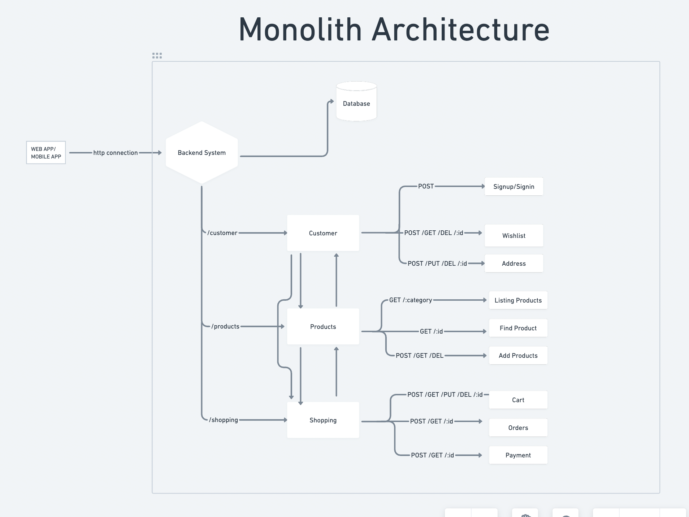
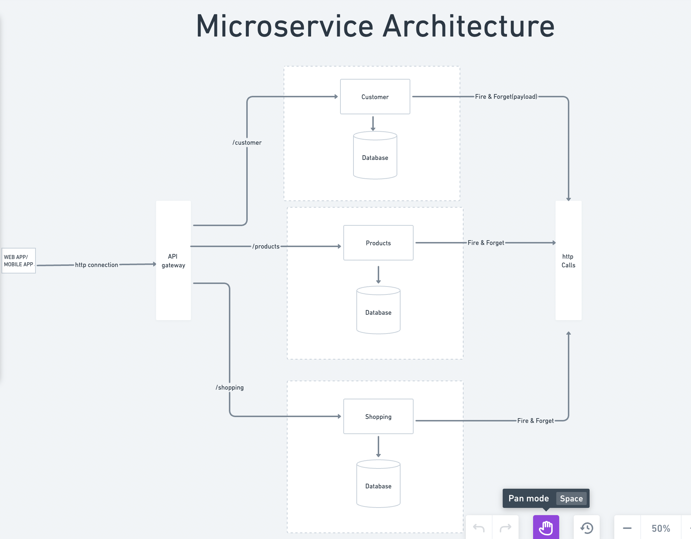
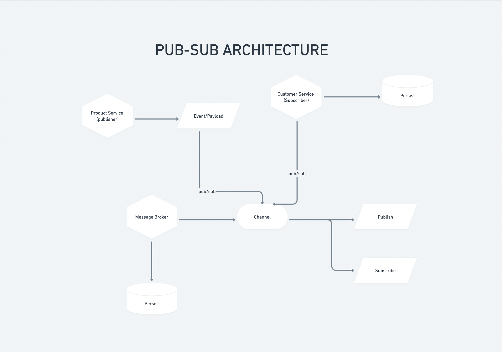

A microservice architecture based apis written to support selling & purchasing of grocery from any seller to any buyer.

## First the monolith design.

## Second the microservice design.

## Communication B/W Microservices:

1. Problem:
   Initially we are using webhook/http calls to communicate between micro services.
   But that has a small issue, i.e. if any of the services went down then we are not
   able to revive/get the fired events for that.

2. Solution:
   To use some kind of message broker or pub-sub Architecture.

